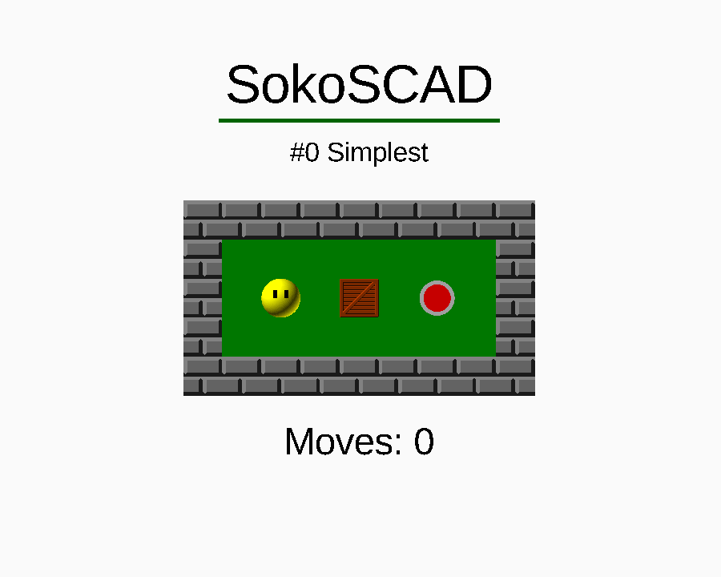

# SokoSCAD

---

It is:

* A tribute to Sokoban
* A personal challenge on the OpenSCAD language
* Sokoban game for OpenSCAD users

---

## Features

For players:

* Playable (with Customizer)
* Selectable levels (with Customizer)

For editors:

* THEMES!
* You can create your own levels!

For developers:

* Simulate cycles using recursive functions.
* Maintain variable reassignments by initiating recursivity while staying
within the scope of reassignment.
* Zero bug appication (OPS! I misspelled)