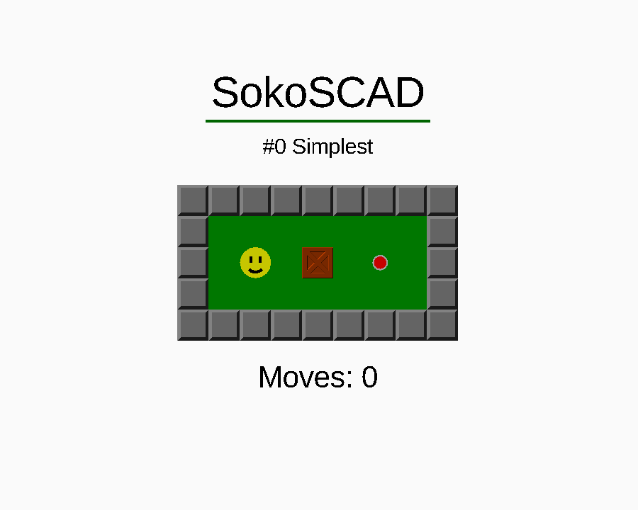

# SokoSCAD

---

It is:

* A tribute to Sokoban
* A personal challenge on the OpenSCAD language
* Sokoban game for OpenSCAD users

---

## Features

For players:

* Playable (with Customizer)
* Selectable levels (with Customizer)

For editors:

* THEMES!
* You can create your own levels!

For developers:

* OpenSCAD is not intended to develop a software, but... I deal with it!
* Simulate cycles using recursive functions.
* Maintain variable reassignments by initiating recursivity while staying
within the scope of reassignment.
* Zero bug appication (OPS! I misspelled)

## Donate

If you feel an irrepressible inner force that pushes you to pay for something free, and press all the digits until you are satisfied.
Or, if you simply want to donate something, you can do so anyway.

  

    
    <noscript></noscript>
  

  

  

    
  

